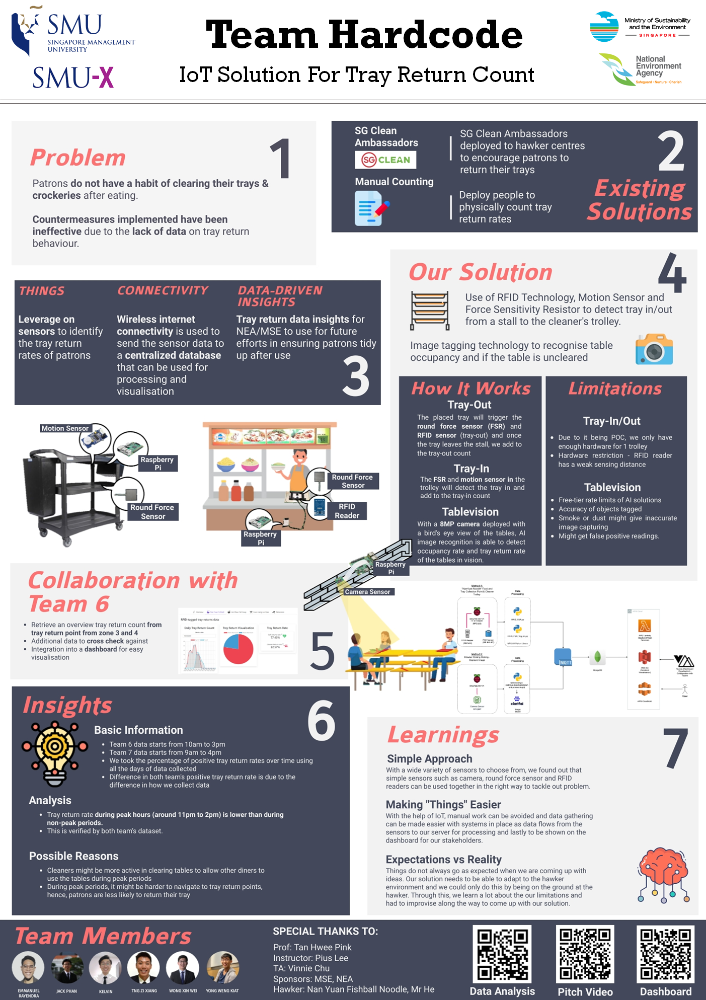

# Hawker centre dilemma: "Must return trays _meh_?"

In collaboration with National Environment Agency (NEA) and Ministry of Sustainability and the Environment (MSE), we leveraged on IoT to collect tray return data at hawker centres so as to gather insights to improve the effectiveness of future campaigns at hawker centres to encourage patrons to return trays.

We came up with two methods:

1. [The first method](../journal/fsr-rfid.md) makes use of RFID, pressure and motion sensor to keep track of the tray movements in and out of the hawker stalls.

2. [The second method](../journal/tablevision.md) uses Artificial Intelligence (AI) to detect the trays and occupancy at the hawker tables. 

Both methods were deployed at Beo Crescent Hawker Centre with positive feedback from the stakeholders. In addition, the data was collected over a week and displayed on a dashboard. 

With our solutions, we may potentially remove the need for manual counting of trays and improve the way in which stakeholders can view the collected data.

## Check out our poster

::: warning NOTE
In the event the QR codes are not functioning, use the below links:

[Data Analysis](https://smu-my.sharepoint.com/:x:/g/personal/zixiang_tng_2018_sis_smu_edu_sg/EWVFzBPjn01CuTNsQ62dQ9oB1s2lpI6zmaiPoY30H6_UCQ?e=1LYl5S)

[View our group's video](https://www.youtube.com/watch?v=JRFURIfBGSg)

[Dashboard](https://d2b9ybaeuz42aa.cloudfront.net/)
:::