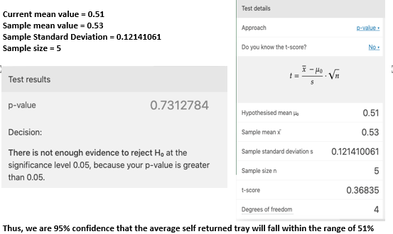

# Detecting Tray In/Out with FSR, RFID & Motion Sensors

## Architecture Diagram

## Overview
Our solution is designed to be placed on respective hawker stalls and cleaner's trolley to track the number of trays that is being taken out from the stall and the number of tray cleared by the cleaners. The main objective of this solution is to make it portable and obstruction-free so it will not hinder hawkers' operations. We will be monitoring negative tray return rate by looking at number of tray return to the trolley, with this data we can do some manipulation and we are able to calculate the postive tray return rate.

### Tray Out
To detect the tray out from the hawker stalls, we used the <b>Round Force Sensor</b> and <b>RFID Sensor</b> together with our RaspberryPi. We have strategically placed our sensors on a board which can detect when a tray is placed on it and when a tray is removed from it. 

Thus, when a tray is removed from the board, the program in the RaspberryPi will add a tray-out count into the database.

### Tray In
At the hawker, we observed that there are two common ways which trays are being returned; the first being the patron returning to the tray return point and the second being the cleaners returning the trays to the cleaners' trolley. 

To count the number of tray return from the patrons, we take the number of tray out from the above method and deduct it by the number of trays returned by the cleaners. The number of trays returned by the cleaners into the trolley is counted by using the <b>Round Force Sensor</b> and <b>Motion Sensor</b> together with the RaspberryPi. 

With strategic placement of our sensors on the trolley, we are able to detect when the cleaners place a tray onto the trolley which will trigger our program in the RaspberryPi to add a tray-in count into our database.

## Sensor Modalities
### How it works - Tray Out
To collect the tray-out data, our aim is to provide a <b>hassle-free</b> and <b>obstruction-free set up</b> for the hawker while collecting accurate data. 

To do so, we used velcros to place our RaspberryPi and sensor board so that it is easy for the hawker to tear down and set up every day. As our solution, will be placed in extreme condition such as heat from boiling water or even possible water spillage. Our team waterproof the entire board using delt and ziplock bag to waterproof the RaspberryPi with just a gap to slot in the power source. On the sensor board, we have the round force sensor and RFID sensor which detects when a tray is placed together and when there is weight placed on the tray. 
 
Once the tray is removed from the sensor board, our program will add a tray-out count into the database.

#### Summarise Flow:
1) Tray being placed on the board - Force detected (Value change from 0 to 1)
2) Food being placed on the tray the weight will push the tray down - RFID Detected (Value change from 0 to 1)
3) Data will be added into the database once the tray is being removed (FSR and RFID value will be reset to 0)

### Sensors we use
* Round Force Sensor (FSR)
* RFID Sensor

#### View Our [Tray in Setup](https://www.youtube.com/watch?v=Xc8Itq1mNtk&feature=youtu.be) 
Here is a short clip on how we setup our tray in method.

### How it works - Tray In
We placed our sensor board in the middle rack of the trolley as we observed that most of the used trays taken from the hawker table by the cleaner were being placed in the middle rack. 

On the sensor board, we have our round force sensor to detect when there is tray placed on the board. This allows us to track the first tray-in count on the trolley and add the relevant count into the database. For subsequent tray-in counts, we used the motion sensor which is placed directly above the board to detect the motion when more trays are placed into the trolley. Upon detection of tray placed into the trolley, we add a tray-in count into the database. 

The round force sensor also help to track when the cleaner remove the stack of trays collected from the trolley back to the stall, when we detect motion and there is no force detected we will take it as a trays had been removed from the trolley. 

Lastly, as the trolley must be mobile and cannot be connected to a power source at all times, we used a portable charger to power the RaspberryPi which was attached to our sensor board.

#### Summarise Flow:
1) When a tray is being placed on the trolley - Force detected (Value change from 0 to 1) - Motion detected (Value change from 0 to 1) 
2) Data will then be added to the database 
3) Once tray is being removed from the trolley - Motion detected (Value change from 0 to 1) - Force not detected (Value change from 1 to 0)
4) Add a minus 1 count to the database

### Sensors we use
* Round Force Sensor (FSR)
* Motion Sensor

## Data, Insights and Accuracy
### Data

The IoT devices used for our Tray In and Tray Out solution connects to the Raspberry Pis which are used as gateway nodes to send data to our [MongoDB](https://www.mongodb.com/) database. The data sent uses [MQTT](https://mqtt.org/) to update our database.

Data collected from the Tray In and Tray Out solution includes:
- **Timestamps**
- **Tray In Count**
- **Tray Out Count**

### Insights
As this solution was deployed as a proof of concept, we deployed the IoT devices over the span of 6 days (27 Oct 2020 to 02 Nov 2020). With the data collected, we are able to deduce the tray return rate and gain useful insights on patrons behavior.
#### Analysis
Tray-in count spike during peak hours (12PM to 2PM) shows that the number of people not returning their trays increases. This was consistent across all days of data that we have collected. Additionally, our collaboration with Team 6 supports the insights that positive tray return rates drops during peak hours, which can be fairly used to backed our insights as both stalls similar with regards to target demographic and food sold.
#### Reasons
Possible reasons for the tray return decrease could be due to:
- Cleaners being more active in cleaning the tables to allow other patrons to use the table during peak hours
- With the peak hour crowd, patrons may find it hard to reach the tray return points to clear their own trays

### Accuracy
#### Ground Truth vs Sensor Data

To identify the accuracy of the data collected, our team collected and compared the ground truth data against data collected from the IoT devices. With reference to the above figure, we used the percent error formula to calculate the accuracy of our data. The data accuracy for **Tray-Out** is at **85%**, while the data accuracy for **Tray-In** is at **46%**. 

The reason why Tray-In data is not accurate was because the motion sensor used are too sensitive and there is no configuration for current motion sensor that we are using. Hence, we resort to taping the sides of the sensors to reduce its sensitivity.

To calculate percentage error, we use this [formula](https://www.omnicalculator.com/statistics/accuracy#how-to-use-the-accuracy-calculator):
| Percent error | 
| ------------- |
|     (\|(Vo - Vₐ)\|/Vₐ) * 100          |

#### Data Validation with MSE

Next, we have also compared between the tray return rate collected by us and MSE's data (Jan 2020 to Oct 2020) to find out the accuracy of our data collection using the IoT solutions. We have plotted chart and calculated the average tray return rate for both the dataset. The tray return rate for our IoT dataset and MSE dataset is **51%** and **53%** respectively. This shows that the dataset collected by our IoT solutions are very similar to MSE's data which are collected using manual inspection and reflects well on the accuracy of the data collected by the IoT solutions.

#### Stats
To further validate the data accuracy, we ran a t-test to compare any significant difference between MSE and our dataset. 

T-test is an popular statiscal test used to determine if there are any difference with the mean 2 groups of data. From the calculation, we are **95%** confidence that the **average self returned tray** will fall within the range of **51%**.

## Visualisations
### Dashboard

The dashboard polls the data from the MongoDB database and reflects the data collection into charts for better visualization. The data included in the dashboard includes:
- Daily Tray In / Tray Out count
- Patrons & Cleaner return count
- Patrons self-return rate
- Cleaner return rate

The daily tray return count feature allow us to view solely Tray-in or Tray-out count and the hourly data collected for each count respectively. This feature enables us to study tray return rate within each hour and allow the identification and study of patrons behavior.

## Limitations
There are several limitation that are worth mentioning:
- Sensitivity of motion sensor
- Multiple Tray return to the trolley at once
- Cleaner directly return to stall
- Limited Hawker center coverage
- Limited range of RFID sensor

### Sensitivity of motion sensor
The motion sensor deployed have a very wide range and could easily detect movement within the surrounding which was not ideal for our solution as we only want to focus on the motion within the trolley, specifically the entry of tray into the trolley. In addition, the movement of the trolley causes the motion sensor to shake and lower the accuracy of the data collected for Tray-in.

### Multiple Tray return to the trolley at once
As our motion sensor and force sensor are binary sensor, it is only to gather and return information of a state (either 0 or 1). Hence, the sensors, in our Tray-In solution, are not able to differentiate between the quantity of the trays entry.

### Cleaner directly return to stall
For convinience sake, cleaners may choose to return trays directly back to the store. Hence, the Tray-In data could be lesser than the actual count.

### Limited Hawker center coverage
As the solution is just a proof-of-concept, we only have the budget to install our solution on 1 of the few trolleys in the hawker center. Hence, data collected will only reflects a sector of the hawker center. However, to make best use of our current limitation, we chose the trolley situated closest to our hawker stall based on our observation of where most of the patrons will likely to be seated at, after purchasing their food, so we could maximize our coverage of the hawker center.

### Limited range of RFID sensor
The RFID sensor only had a detection range of 5-7CM, which are only detectable near contact. Hence, tray has to be placed in a precise position for the RFID sensor to detect. To overcome this solution, our team have pasted 2 RFID stickers on both side of the tray to ensure that the RFID sensor is able to detect the tray accurately. RFID range will also be affected with any metal product nearby, for our solution we overcome this by putting a styrofoam board between the sensors and the metal cabinet to reduce the impact on our RFID reader. 

## Key Benefits Of Our Solution
The key benefits includes:
- Automating data collection process
- Identifying patrons behavior during specific periods of time

### Automating data collection process
With the IoT solution deployed, we could automate the manual data collection process of tray return and could provide reliable counting without possible human errors as our IoT solution has shown high accuracy of the data collected.

### Identifying patrons behavior during specific periods of time
The dashboard feature allow us to view tray return rate for specific periods of time. From the data analysed, we could see that patrons are less likely to return trays during peak hours. With such a useful insight, we could pin point the reason behind such behavior and works towards creating campaign and solution targeted at the specific timing or patrons.

## Main Video

### To see how our solution works at the hawker: 

#### View our [group's video](https://www.youtube.com/watch?v=JRFURIfBGSg)
