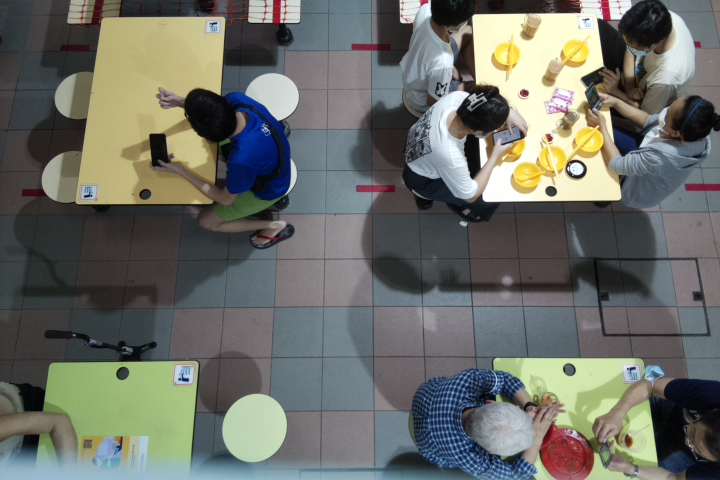
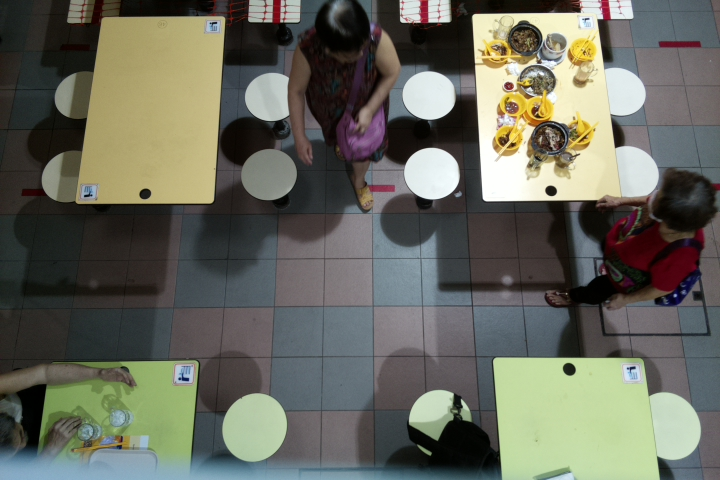
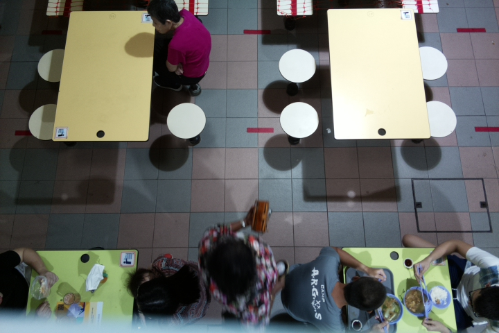
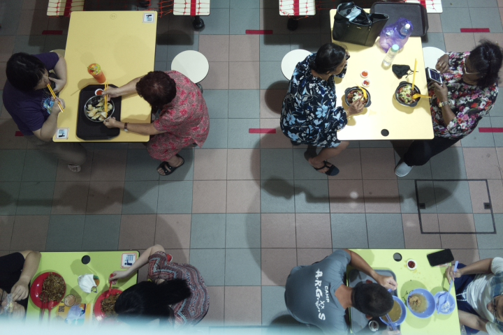
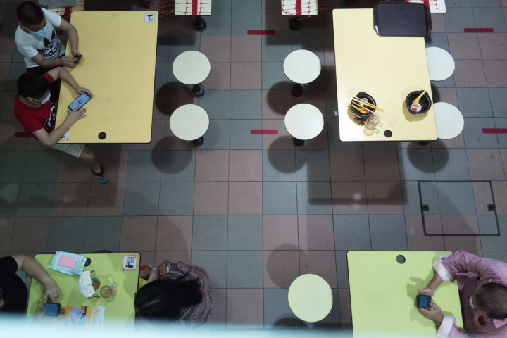
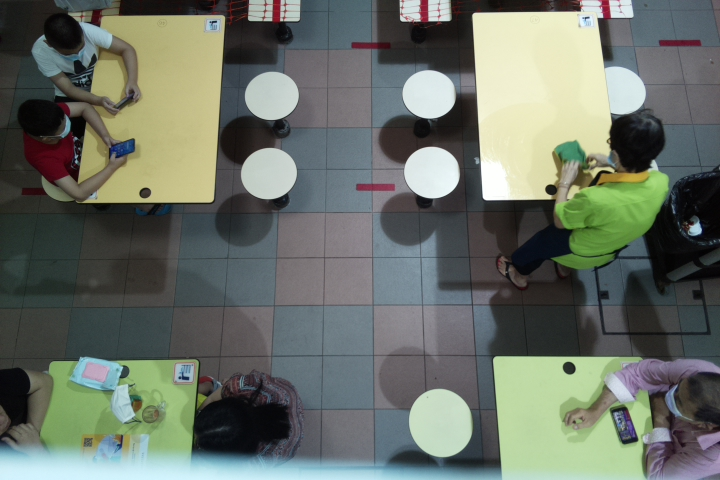
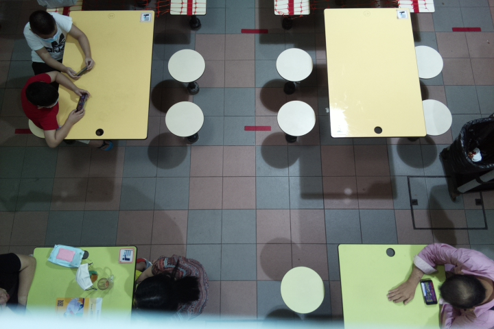

# Tablevision: AI-Powered Tray Return Monitoring

## Architecture Diagram

## Initializing & Image Cropping

### Demonstration

### What are we doing here?
Essentially, we are setting the table boundary such that our custom program will only take into account of the table boundary while we process our image with our model. 

## Processor
The processor aims to decouple the heavy processing logic away from the raspberry pi that is deploy together with our camera module on Beo Crescent. 

Firstly, It provides an endpoint for Image to sent. It then do some preprocessing and make an API Call to our Google Vision Model. It will then receives the result from Google Vision API, go through our Session State Logic and update our Table State accordingly.

## Google Vision API
The Google Vision API enable us to derive and detect objects from the image that is captured with our camera modules. 

Before this, we have deployed our camera modules to capture a series of images in order to train our customised model on Google Vision. This allow us to accurately predict "Human/Person" on the table, as well as "Crockeries" and "Trays". 

Below is a GIF on how we train our model

## Session State

| State | Crockery | People |
|---|----------|--------|
| 0 | ❌        | ❌      |
| 1 | ✅        | ❌      |
| 2 | ✅        | ✅      |

### Example Session

#### Positive Tray Return (Self-Return)
**States**

0 -> 2 -> 0

**State 0: Empty Table on the left**

**State 2: Table Occupied**

**State 0: Table Empty Again (Self Return)**

#### Negative Tray Return (Cleaner-Return)
**States**

0 -> 2 -> 1 -> 0

**State 0: Empty Table on the right**

**State 2: Table Occupied**

**State 1: Person Left, Crockeries Still On Table**

**State 0: Table Empty Again After Cleaner Clean(Cleaner Return)**

