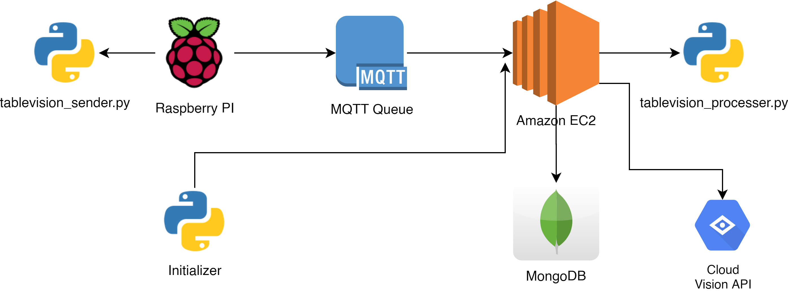

# Tablevision: Tray Returns Monitoring with AI

## Architecture Diagram


## Overview

::: tip NOTE
The term "tray returns" is our umbrella term that refers to hawker centre trays or crockeries (i.e. bowls, cutleries, plates) returned to the Tray Return Point.
:::

Our solution incorporates an 8-megapixel camera sensor, connected to a sensor gateway. In our case, the gateway is our Raspberry Pi. It is designed to be able to automate the detection of self-initiated tray returns – or the reverse of tray returns by cleaners, through a custom machine learning model training.

Through Tablevision, we are able to monitor:

* **Negative tray return rates**: a measure of tray returns by the cleaners – hence the term "negative" which indicates negative behaviour by patrons for not clearing trays, and;
* **Positive tray return rates**: a measure of tray self-returns by patrons – the term "positive" indicates the positive behaviour of patrons clearing up after eating

## Training our Machine Learning Model

Initially, we used the [Clarif.ai API](https://www.clarifai.com/) for its object detection API. However, the free version is only available for 1,000 API calls, which was insufficient for our use case. Furthermore, we needed a pay-as-you-go (PAYG) model that enables us to have a fine-grained billing for our object detection, and Clarif.ai's pricing model only indicates prices per block of API calls.

[Google Cloud Vision AI](https://cloud.google.com/vision) comes in as our next reliable alternative. It enables us to derive and detect objects from the image captured with our camera modules, and it comes with a pay-as-you-go model. 

We decided to give it a try.

And that's when we realised that Google had generously given us free $300 credits for model training and image detection, on top of the $300 credit already given as a promotion to use any of Google Cloud's services. Such a great way to let us students experiment with Cloud technologies.

To train our model, we used a series of images that we captured from our installed camera module atop some tables, such as the picture below:


This allows us to easily tag images and detect objects based on our classification labels of what:

* a "Human/Person" is
* "Crockeries" on the table, and;
* "Trays" on the table

Below is a quick animation of how we trained our Cloud Vision AI model:


## Initialising Tablevision

In order to accurately detect our table boundaries and ID-tag it accordingly (i.e. Table 46, Table 47, etc...), we needed a way to provide coordinates for our algorithm to detect whether a particular table is occupied, or has uncleared trays.

For this, we leveraged on the `matplotlib` Python library to provide the X-y coordinates of our boundaries. We used the `widgets.RectangleSelector` function to provide us with the 4-point coordinates of the rectangle of our boundary.


After initialising, we will send our table coordinates to our _Processer_. _Processer_ will create `Table` objects with the coordinates specified.

## Sensor modalities

### Defining session states

| State | Crocker(ies) | People | Meaning |
|---|----------|--------| --------|
| 0 | ❌        | ❌      | Vacant |
| 1 | ✅        | ❌      | Vacant but uncleared table |
| 2 | ✅        | ✅      | Occupied |

We used the table states to detect each session and the activities. In summary, we could simply differentiate the behaviour by:

* **Positive tray-returns**, or self-returns
    - Table state **0 -> 2 -> 0**
* **Negative tray-returns**, or cleaner-cleared trays
    - Table state **0 -> 2 -> 1 -> 0**

### Processing the logic

The `tablevision_processer.py` script, or what we call, _The Processor_, is essentially an API endpoint that aims to decouple the heavy processing logic away from the low-compute power of the Raspberry Pi, which was deployed together with our camera module at Beo Crescent.

The _Processor_ was deployed on the Cloud using a basic Compute instance (in our case, AWS EC2). In this _instance_ (pun intended), it might be an overkill to use an entire EC2, and we could've opted for something like Firebase instead. However, we just wanted something quick and familiar while we worry about getting the right data and insights.

The _Processor_ acts as a Cloud API endpoint to receive our images from the Raspberry Pi. It then sends an API request to our Google Vision AI deployed model. 

An example of the result returned by the Google Vision API is, after formatting by our `resultFormatter(prediction)` in _The Processer_:

```py
def resultFormatter(prediction):

    # ... processing the format of prediction here ...

    # centre is used to map out the average location of an object. 
    # This is for us to detect if the object is roughly within the boundaries of a table.
    centre = {"x": (min(x) + max(x)) / 2, "y": (min(y) + max(y)) / 2}

    return {
        "name": "Tray",
        "location_boundary": {
            "x": [0.03948170731707307, 0.4337906504065041],
            "y": [0.09692911255411243, 0.09692911255411243]
        },
        "score": 0.95,
        "centre_point": centre
    }
```

Essentially, in a short and sweet summary, our _Processer_ API endpoint does the following:

1. Receives image from our Raspberry Pi deployed on-site
2. Sends the image to Google Cloud Vision AI API
3. Receives object prediction results from Vision AI API
4. Loop through our defined tables
5. Is the object within a table's boundaries?
    - If the coordinates are within a table's boundaries, update the state of the particular table
    - If no, don't do anything

::: warning Managing limitations in automated data collection
There are some measures put in place to prevent "unclean" data and limitations to the solution. 

For example, if there are transient people (such as a cleaner entering the table frame to clear crockeries and trays), it might be detected as **Occupied**. So for this, we created a **minimum session timing of 3 minutes**, or 180 seconds.
:::

## Data, Insights and Accuracy

### Data

The camera module for Tablevision is connected to the Raspberry Pi. The Pi is used as a gateway node to send image data to our _Processer_, which processes logic and sends the table state data to our MongoDB databas. An example of a table session data is as follows:

```json
{
    "_id": {
        "$oid": "5f9386a54c5857a2a68e16e9"
    },
    "sessionId": {
        "$binary": "DhX1DPJkR/O+gBx+e+BrJQ==",
        "$type": "3"
    },
    "sessionStart": {
        "$date": "2020-10-24T01:43:01.630Z"
    },
    "states": [0, 2, 0],
    "tableId": 46,
    "sessionEnd": {
        "$date": "2020-10-24T01:59:53.236Z"
    },
    "tray_count": 2
}
```

From the above data entry, notice the `states` attribute of `[0, 2, 0]`. The state has gone 
from **0 (vacant) -> 2 (occupied) -> 0 (vacant)**, which indicates that a patron self-return has occurred.

### Insights

As our tablevision solution was deployed as a proof of concept, we deployed the camera over the span of 4 full days (27 Oct 2020 to 30 Oct 2020). With the data collected, we are able to deduce the tray return rate and gain useful insights on patrons behavior.

As we were able to utilise and make full use of our trained model for detecting object, we were able to log down the number of trays that is on the table per session. With the number of trays data available, we were able to gain useful insights on the patrons behavior. Below is the distribution frequency for positive/negative tray return for x given number of tray.

**Positive Tray Return (Self Return)**

| No. of Trays | Cumulative Distribution (%)|
|---|----------|--------| --------|
| 1 | 45.44% |
| 2 | 32.34% |
| 3 | 9.72% |
| 4 | 12.5% |

**Negative Tray Return (Cleaner Return)**

| No. of Trays | Cumulative Distribution (%)|
|---|----------|--------| --------|
| 1 | 17.52% |
| 2 | 17.88% |
| 3 | 24.09% |
| 4 | 40.51% |

Hence, we are able to conclude the following:

1. For **Positive Self Return**, most patron will return their own tray if the tray count is less than 3
2. For **Negative Cleaner Return**, most patron does not return their own tray if the tray count is more than 2

### Accuracy

#### Ground Truth vs Sensor Data


To identify the accuracy of the data collected, our team collected and compared the ground truth data against data collected from the IoT devices. With reference to the above figure, we used the percent error formula to calculate the accuracy of our data. The data accuracy for Table Vision is at 46.15%.

To calculate percentage error, we use this [formula](https://www.omnicalculator.com/statistics/accuracy#how-to-use-the-accuracy-calculator):
| Percent error | 
| ------------- |
|     (\|(Vo - Vₐ)\|/Vₐ) * 100          |

#### Stats

To further validate the data accuracy, we ran a t-test to compare any significant difference between MSE and our dataset.


From the calculation, we are 95% confidence that the average self returned tray will fall within the range of 51%

## Limitations

### Immediate swap of patrons

During peak hours, patrons might quickly swap with one another, as seen in the below illustration:


In such instances; as our camera only sends image data every ~2-3 seconds, the camera is not able to detect such state changes. This might result in data collection inaccuracies.

However, we considered the following statements to counter this limitation:

* As per the cleaning shift supervisor's directives, trays cannot be cleared when the patron who ate the meal with the tray is still sitting down
* Patrons who are seated in an uncleared table will ask the cleaners to kindly clear the table for them

With these statements, one might be able to implement, using the following pseudocode:

```
if Current State is 2:
    if table without Crockeries or Trays:
        then begin new session
        set previous session to 0 > 2 > 1 > 0
```

**NOTE**: _This means that cleaner has cleared the tray, indicating the negative tray return behaviour of the previous patron._

## Key Benefits of Tablevision

Tablevision might help to benefit the data collection process of tray return behaviour by:

* identifying tray return behaviour through automated object detection
* cheaper than deploying manual surveyors in the long run
* data is digitised, processes are digitalised
* scale to needs and new functionalities

### Identifying tray return behaviour & automating data collection

Leveraging on AI to automatically detect objects, we are able to process logic to understand tray return behaviour. This reduces the need to deploy surveyors as manual labour, and reduces on costs to deploy staff as tray return ambassadors/surveyors.

### Tablevision digitalises data collection

With Tablevision, it's not just digitising the data we collect on tray return behaviour, but it digitalises the way data collection processes are done.

### Scale to needs and new functionalities

With Tablevision's object boundary functionality, one can rapidly add more table boundaries through initialising Tablevision. Furthermore, the field-of-view of Tablevision is only limited to the infrastructure that Tablevision is deployed at.

If one is able to deploy a large camera sensor with a wide-angle lens – or a higher location, Tablevision can be specified to include more tables.

More functionalities can be added to Tablevision, such as trash and waste detection, easily. This only requires one to train the custom model for Tablevision.

## Costs

### Hardware

| Product | Price (SGD) |
|---------|-------|
| Sony IMX219 Raspberry Pi 8MP Camera Module | **$ 42** |
| Raspberry Pi 3b+ (Provided by the SMU-X Faculty) | **$ ~50<sup>?</sup>** |

Honestly, any camera that's greater than 2MP will do, which includes ordinary web cameras connected through the USB port of the Raspberry Pi.

We did not include the costs of using mobile networks through our internet hotspot as this is a proof-of-concept. A fully production-ready deployment would have accounted for networking infrastructure such as the fibre network connectivity.

### Software + AI

::: warning P.S.
We couldn't have executed this without worry if it weren't for the surprising promotional credits for AutoML Vision API.
:::

Our fixed cost was used to train the machine learning model on AutoML Vision API. We spent a total of **6.87 hours** to train **51 images** with the 3 labels for **US$ 29.73**.

As per November 2020, [Google Cloud Vision API](https://cloud.google.com/vision/automl/pricing#image_classification_deployment_and_prediction_costs)'s Pricing page states (in USD):

> The cost for AutoML Vision Image Classification model training is **$3.15 per node hour**.
>
> For each unit of time, we use 8 nodes in parallel, where each node is equivalent to a n1-standard-8 machine with an attached NVIDIA® Tesla® V100 GPU.

> The cost for deployment and prediction is **$1.25 per node hour**. One node is usually sufficient for most experimental traffic.

The main disadvantage of using the AutoML Vision AI is that the compute instances used to deploy our models doesn't automatically scale down or up when needed. This will result in underutilised model deployments and is not cost effective at all.

If we were to deploy for 14 hours with one node (our current configuration for the proof-of-concept) – the length of Beo Crescent Market Food Centre's operating hours, that will cost **S$ 35** per operational day (taken from our billing statement in SGD)

| Product | Price (SGD) | Units |
|---------|-------|-------|
| AutoML Model Training | **$ 29.73** | One-time
| Prediction request deployment | **$ 35** | per day

We discovered that one could deploy the AutoML model on Cloud Run, which is essentially Google's answer to AWS Lambda – Functions-as-a-Service (FaaS). However, due to the limited timeframe of the project (and partly, due to the free credits 😊 ), we did not deploy the model on Cloud Run.

If you're interested, this [Medium article by Juri Sarbach](https://medium.com/@juri.sarbach/how-to-deploy-your-automl-model-in-a-cost-effective-way-5efdd377d4d2) walks the reader through on how to export the AutoML Model to Google Cloud Storage (GCS), and then to Cloud Run.

However, Juri pointed out the tradeoff with using Cloud Run:

> _Typically, scale-to-zero services suffer from cold start latency when they haven’t been used for some time._

In short, if we were to deploy on Cloud Run, here's the quick maths behind it:

* Our requests come in once every 2 seconds, or about **420 requests per day**

From the [Google Cloud Run Pricing page](https://cloud.google.com/run/pricing):
* 2 million requests free per month
* US$ 0.40 / million requests beyond the free quota

Then, for the sake of simple calculations:

| Product | Price (SGD) | Units |
|---------|-------|-------|
| AutoML Model Training | **$ 42** | One-time
| Cloud Run deployment | **FREE<sup>1</sup>** | per month

_<sup>1</sup> For the sake of quick calculations, not considering networking costs incurred by transferring images across the mobile network (mobile hotspot), our Cloud Run deployment should be nearly free._