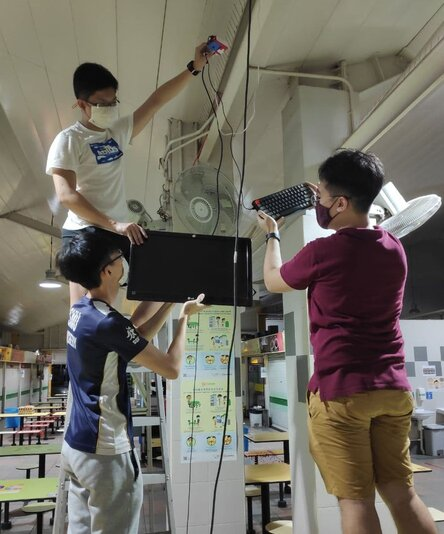

# Team Hardcode's Beo Cresent Journey Gallery 

## Site Visit
On 23 August 2020, we went on site to see what is the current situation in the hawker center and possible IoT solutions that could assist our sponsors.

On 25 September 2020, we went down to see how we can install our IoT solution and discuss with the site supervisor Mr Tan on our setup plan.

## Proof of Data Collection 
On 13 October, we tested our implementation in School and proceeded to a nearby hawker centre to test our prototype. 

We were testing our prototype and realised that metal surfaces will affect the RFID readings.

## Proof of Deployment

We went down to Beo Crescent Hawker Centre to deploy our image sensor and to test the accuracy of our model

Supper after a long night of installation

RFID and Trolley deployment

## Interview with the Site Supervisor

## Video Editing Scene

## Final Presentation

